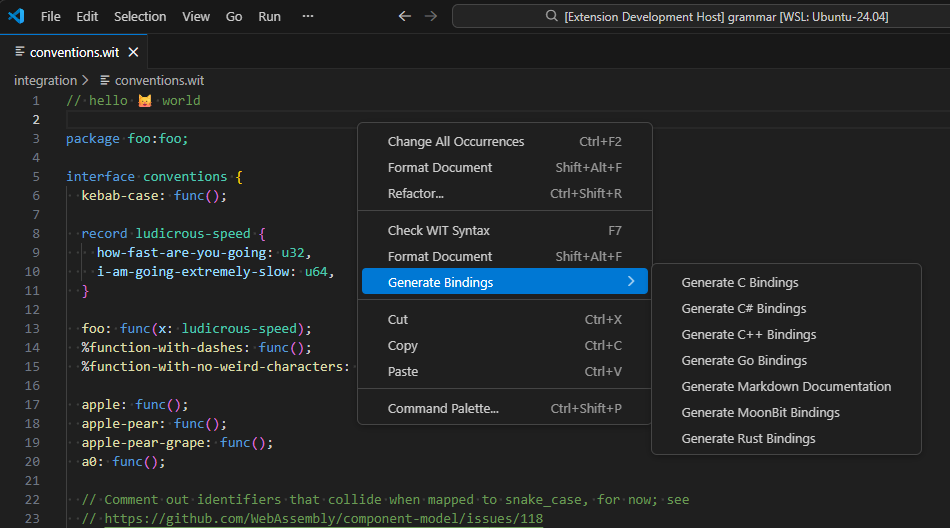
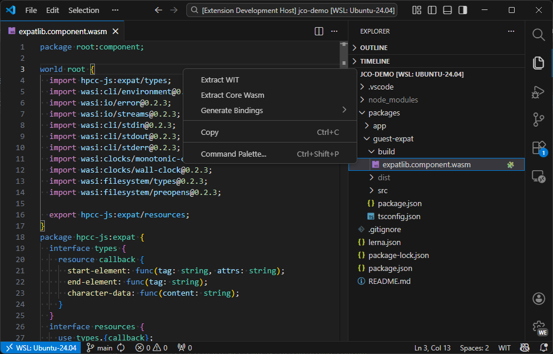

# WIT IDL for VSCode



_A comprehensive Visual Studio Code extension for WebAssembly Interface Type (WIT) development. This extension provides **syntax highlighting**, **validation**, **formatting**, **language bindings generation**, and **WebAssembly component tooling** for the WIT Interface Definition Language (IDL). Also compatible as a TextMate bundle._

**Key Features:**
- 🎨 Full syntax highlighting and code completion
- ✅ Real-time syntax validation with detailed error diagnostics
- 🔧 Automatic code formatting
- 🌐 Generate guest bindings for Rust, C, C++, C#, Go, MoonBit, and JavaScript
- 🧱 Generate JavaScript host bindings from WIT or `.wasm` components
- 📚 Generate Markdown documentation from WIT definitions
- 🧩 WebAssembly component detection and WIT extraction
- 📝 Context menu integration for quick access to tools

The description of the WIT format can be found at: https://github.com/WebAssembly/component-model/blob/main/design/mvp/WIT.md

## Features

This extension provides comprehensive support for WebAssembly Interface Type (WIT) files and WebAssembly components:

### Language Support
- **Syntax Highlighting**: Full TextMate grammar for WIT files with proper scoping
- **Code Snippets**: Pre-built snippets for worlds, interfaces, and common patterns
- **Markdown in Comments**: Syntax highlighting for markdown within WIT comments
- **Code Completion**: Context-aware autocomplete for WIT keywords and constructs

### Validation and Diagnostics

#### Automatic Validation
- **On File Save**: Automatically validates WIT files when saved
- **On File Open**: Validates WIT files when opened in the editor
- **Real-time Feedback**: Errors appear immediately in VS Code's PROBLEMS pane
- **Workspace Validation**: Validate all WIT files across your entire workspace

#### Error Display
- **Precise Location**: Errors show exact line and column numbers
- **Detailed Messages**: Clear descriptions of syntax errors with context
- **Quick Navigation**: Click any error in PROBLEMS pane to jump to the issue
- **Multi-file Support**: Track errors across multiple files simultaneously

### Document Formatting

Format WIT files with a single command:
- **Auto-formatting**: Format on save or on demand
- **Consistent Style**: Ensures uniform code style across your project
- **Default Formatter**: Automatically set as the default formatter for `.wit` files
- **Keyboard Shortcut**: `Shift+Alt+F` to format the active document

### Binding Generation

Generate language bindings directly from WIT files or WebAssembly components:

#### Guest Bindings
- **Rust**: Generate idiomatic Rust bindings with `wit-bindgen`
- **C**: Generate C bindings for C projects
- **C++**: Generate C++ bindings
- **C#**: Generate C# bindings for .NET projects
- **Go**: Generate Go bindings
- **MoonBit**: Generate MoonBit bindings
- **JavaScript**: Generate JavaScript/TypeScript guest-side bindings

#### Host Bindings
- **JavaScript**: Generate host-side JavaScript output
  - For `.wit` files, generates host-oriented TypeScript declarations
  - For `.wasm` components, transpiles to runnable JavaScript host modules

#### Documentation Output
- **Markdown**: Generate documentation in Markdown format

#### Binding Generation Features
- **Context Menu Integration**: Right-click on `.wit` or `.wasm` files to generate outputs
- **Structured Menus**: Separate submenus for guest bindings, host bindings, and documentation
- **Output to Folder**: Preserves generated relative folder layout safely
- **Progress Feedback**: Visual feedback during generation process

### WebAssembly Component Support




#### Component Detection
- **Visual Indicators**: WebAssembly component files (`.wasm`) are decorated with a 🧩 emoji in the Explorer
- **Component Colors**: Customizable color scheme for component files in the file explorer
- **Automatic Detection**: Distinguishes between core WebAssembly modules and components

#### Component Operations
- **Extract WIT**: Extract WIT definitions from compiled WebAssembly components
- **Extract Core Wasm**: Extract the core WebAssembly module from a component
- **Custom Editor**: View WIT interfaces directly from `.wasm` component files
- **Real-time Updates**: WIT view updates automatically when the component file changes

### Context Menu Integration

Right-click on files in the editor or Explorer for quick access to:

**For `.wit` files:**
- Check WIT Syntax
- Format Document
- Generate Guest Bindings (submenu)
- Generate Host Bindings (submenu)
- Generate Documentation (submenu)

**For `.wasm` component files:**
- Extract WIT
- Extract Core Wasm
- Generate Guest Bindings (submenu)
- Generate Host Bindings (submenu)
- Generate Documentation (submenu)

## Available Commands

Access these commands via the Command Palette (`Ctrl+Shift+P` or `Cmd+Shift+P`):

### Validation Commands
- **WIT: Check WIT Syntax** (`F7` when in a WIT file)
  - Validates the currently active WIT file
  - Shows errors in the PROBLEMS pane and notifications
  
- **WIT: Check WIT Syntax in Workspace** (`Shift+F7`)
  - Validates all WIT files in the workspace
  - Shows progress notification during validation
  - Provides summary of results in output channel

### Formatting Commands
- **WIT: Format Document** (`Shift+Alt+F` when in a WIT file)
  - Formats the current WIT file
  - Applies consistent styling and indentation

### Binding Generation Commands
- **WIT: Generate Rust Bindings**
  - Generates Rust guest bindings using `wit-bindgen`
  
- **WIT: Generate C Bindings**
  - Generates C guest bindings for C projects
  
- **WIT: Generate C++ Bindings**
  - Generates C++ guest bindings
  
- **WIT: Generate C# Bindings**
  - Generates C# guest bindings for .NET projects
  
- **WIT: Generate Go Bindings**
  - Generates Go guest bindings
  
- **WIT: Generate MoonBit Bindings**
  - Generates MoonBit guest bindings

- **WIT: Generate JavaScript Bindings (Guest)**
  - Generates JavaScript/TypeScript guest bindings from `.wit` or extracted component WIT

- **WIT: Generate JavaScript Bindings (Host)**
  - Generates host-side JavaScript output
  - Uses host type generation for `.wit`, and component transpilation for `.wasm`
  
- **WIT: Generate Markdown Documentation**
  - Generates Markdown documentation from WIT definitions

> Note: legacy command IDs for `wit-idl.generateBindings*` are still supported as deprecated aliases for backward compatibility.

### WebAssembly Component Commands
- **WIT: Extract WIT**
  - Extracts WIT definitions from a WebAssembly component file
  - Available only for component-type `.wasm` files
  
- **WIT: Extract Core Wasm**
  - Extracts the core WebAssembly module from a component
  - Available only for component-type `.wasm` files

### Utility Commands
- **WIT: Show WIT Bindgen Version**
  - Displays the version of wit-bindgen used by the extension

## Keyboard Shortcuts

| Command | Shortcut | When |
|---------|----------|------|
| Check WIT Syntax | `F7` | Editing a `.wit` file |
| Check WIT Syntax in Workspace | `Shift+F7` | Anytime |
| Format Document | `Shift+Alt+F` | Editing a `.wit` file |

## Extension Settings

This extension contributes the following settings:

### Default Formatter
The extension automatically configures itself as the default formatter for WIT files. This is equivalent to:

```json
{
  "[wit]": {
    "editor.defaultFormatter": "bytecodealliance.wit-idl"
  }
}
```

You can override this in your user or workspace settings if needed.

### Component File Decoration Color
Customize the color used to decorate WebAssembly component files in the Explorer:

- **Color ID**: `witIdl.componentColor`
- **Description**: Color used to decorate WebAssembly component files (.wasm) in the explorer
- **Defaults**:
  - Light theme: `#5043b3`
  - Dark theme: `#7c5eff`
  - High contrast: `#b15eff`

To customize, add to your settings:

```json
{
  "workbench.colorCustomizations": {
    "witIdl.componentColor": "#your-color-here"
  }
}
```

## Installation

### From Marketplace

This extension is available on:

- **Visual Studio Marketplace**: For VS Code users
  - Install directly from VS Code: Search for "WIT IDL" in the Extensions view
  - Or visit: https://marketplace.visualstudio.com/items?itemName=bytecodealliance.wit-idl

- **Open VSX Registry**: For VSCodium and other compatible editors
  - Install from Open VSX: https://open-vsx.org/extension/bytecodealliance/wit-idl
  - Or install via CLI: `ovsx get bytecodealliance.wit-idl`

### From Source

#### Prerequisites

This extension includes a WebAssembly component that requires the following tools for building:

- **Rust** (with `cargo`): Required for building the WebAssembly module
- **wasm-pack v0.13.1**: Used specifically for the `wit-bindgen-wasm` subproject

You can install these dependencies by running:
```bash
# Install Rust (if not already installed)
curl --proto '=https' --tlsv1.2 -sSf https://sh.rustup.rs | sh

# Run the setup script to install build tools
npm run setup-wasm
```


To install from source, follow these steps:
* Clone the repository: `git clone https://github.com/bytecodealliance/vscode-wit.git && cd vscode-wit`
* Install build dependencies: `npm run setup-wasm`
* Run npm commands to install:
`npm ci && npm run install-extension`

## Testing

The extension includes comprehensive tests:

```bash
# Run all tests (lint, format, build, grammar, unit tests)
npm test

# Run unit tests only
npm run test-unit

# Run unit tests with coverage report
npm run test-unit-coverage

# Run tests in watch mode
npm run test-unit-watch
```

For Go WASM integration tests, see [docs/GO_TESTING.md](docs/GO_TESTING.md).

## Publishing (for maintainers)

This extension is automatically published to both Visual Studio Marketplace and Open VSX Registry through GitHub Actions when a release is created.

**Required secrets:**
- `PAT_VSCE`: Personal Access Token for Visual Studio Marketplace
- `OVSX_PAT`: Personal Access Token for Open VSX Registry

