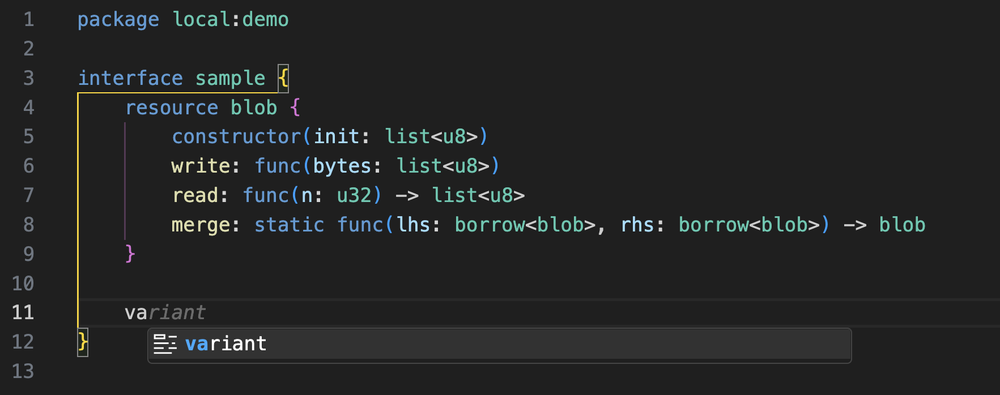

# WIT IDL for VSCode

This package is a Visual Studio Code extension to recognize and highlight the WebAssembly Interface Type (WIT) Interface Definition Language (IDL). It can also be used as a bundle in TextMate.

The description of the WIT format can be found at: https://github.com/WebAssembly/component-model/blob/main/design/mvp/WIT.md

## Features

This extension provides:
- Basic syntax highlighting of ".wit" files.
- [Snippets](https://code.visualstudio.com/docs/editor/userdefinedsnippets) for worlds and interfaces.
- Basic markdown highlighting in comments.
- Simple list-based autocomplete.

## Installation

To install from source, follow these steps:
* Clone the repository: `git clone https://github.com/bytecodealliance/vscode-wit.git && cd vscode-wit`
* Run npm commands to install:
`npm ci && npm run install-plugin`
